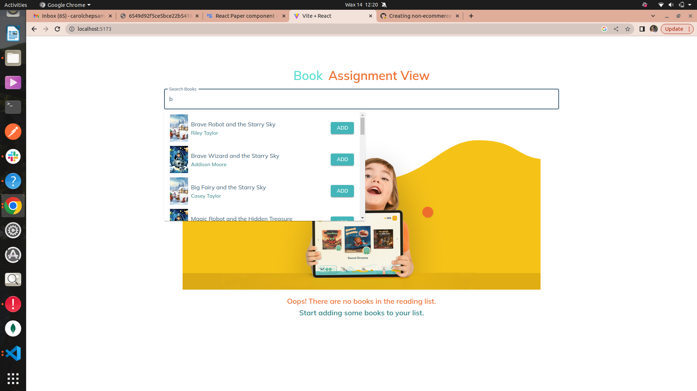

# Book Assignment View

Book Assignment View is a React application that allows users to search for books and add them to their reading list. It fetches book data from a GraphQL endpoint using Apollo Client.

## Features

- Search for books by title and add books to reading list


- Display reading list  and remove books from reading list


- Error handling for failed data fetching


- A fall back UI when reading list is empty


- paginating the books


## Technologies Used

- React: A JavaScript library for building user interfaces
- Material-UI: A popular React UI framework for designing responsive web applications
- Apollo Client: A comprehensive state management library for managing GraphQL data in React applications

## Additional Features

- Linting: Ensured code consistency and quality through linting.
- Testing: Implemented tests to ensure functionality and reliability.
- Continuous Integration: Set up GitHub Actions for automated testing and deployment.
## Installation

To run the project locally, follow these steps:

1. Clone the repository:

   ```bash
   git clone https://github.com/carolchep/ello-assignment
2. Navigate to the project directory: frontend directory
3. npm i 
4. npm run dev
